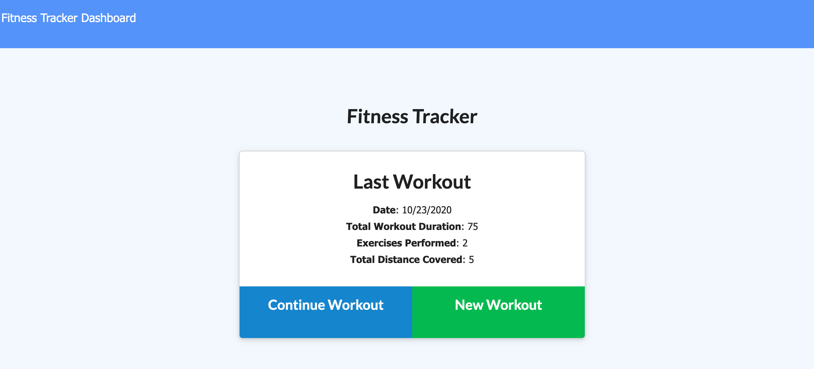
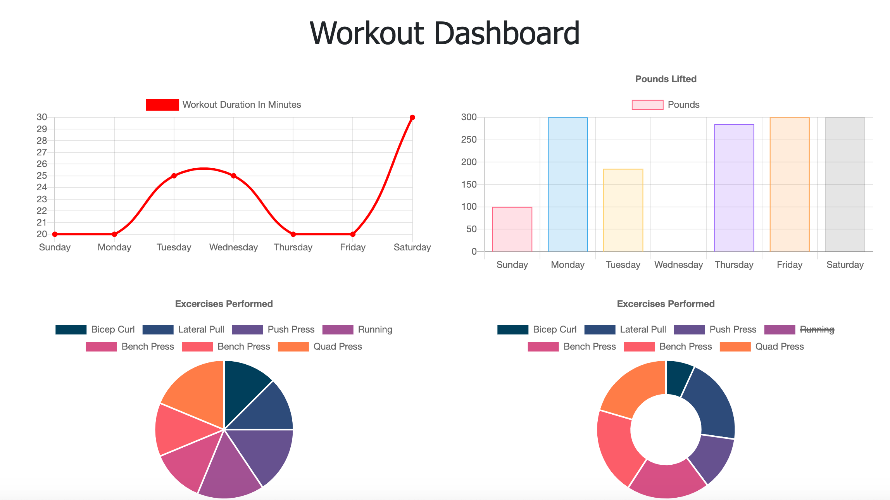

# Fitness Tracker 

## Description 
This application is a Fitness Tracker designed to record and save workouts. The user is able to log as many different exercises as they'd like each day. They will be asked to enter the exercise name, type, and duration. Optionally, they can enter the weight, sets, and reps for resistance workouts or the distance traveled for cardio workouts. The user can also view all previous workouts and track their progress through the dashboard. 

</>

</>

## Table of Contents
- [Installation](#installation)
- [Usage](#usage)
- [License](#license)
- [Contributions](#contributions)
- [Tests](#tests)
- [Questions](#questions) 
  

## Installation
The user will need to have NPM installed prior to running this application.

## Usage
The user can utilize this application via the deployed Heroku link provided above. 

## License
Notice: This is licensed under ISC.

## Contributions 
You may contribute to this application by forking the repository via my GitHub link below.

## Tests 
This application was run through multiple NPM tests.

## Questions
Please feel free to view my GitHub profile at https://github.com/jeniglar or email me directly at jeniglar@gmail.com with any additional questions.
